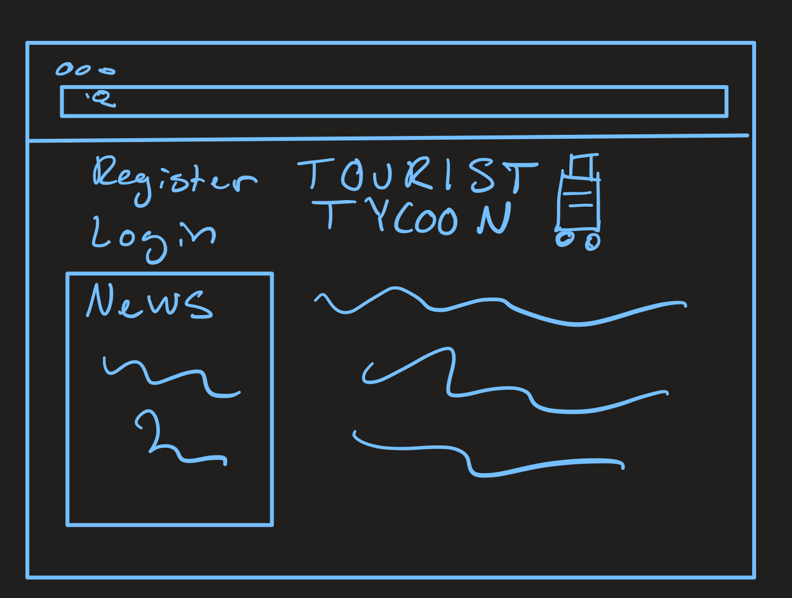
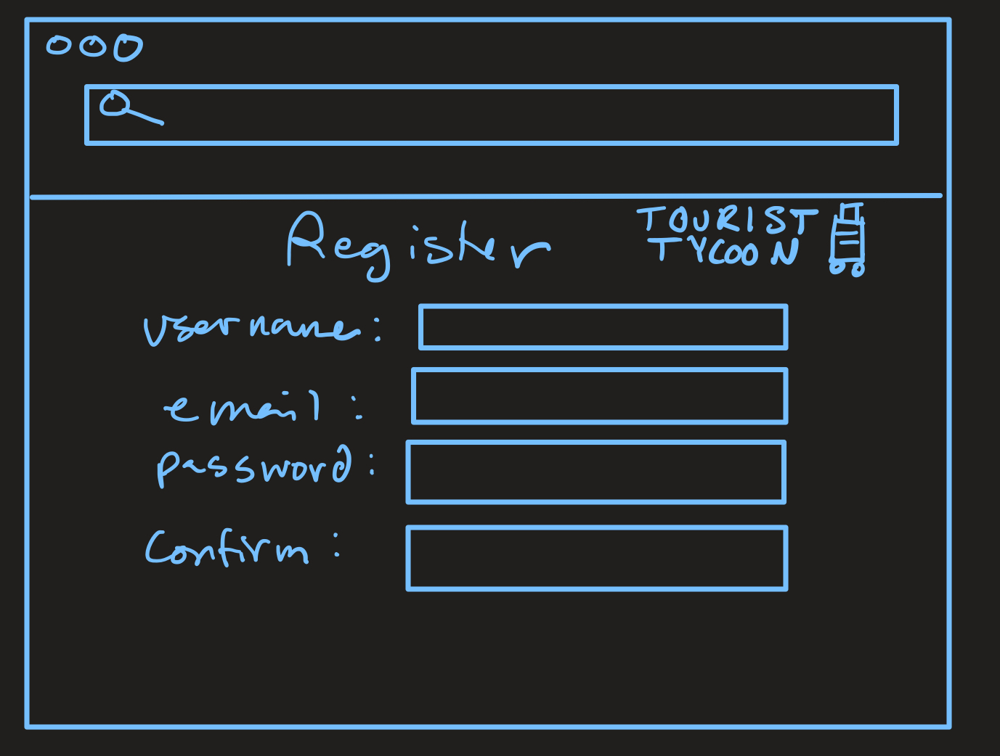
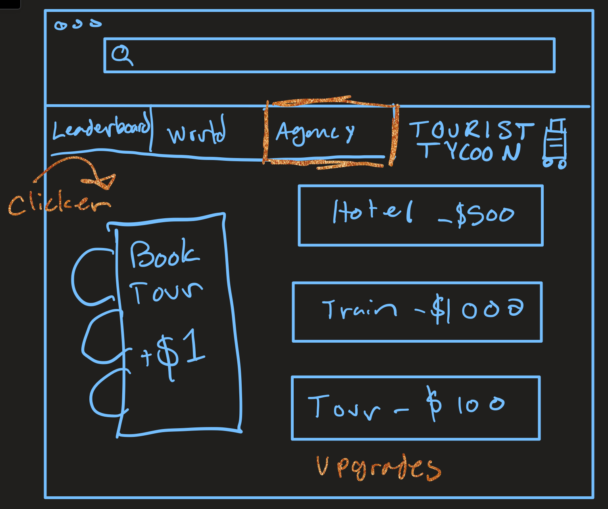
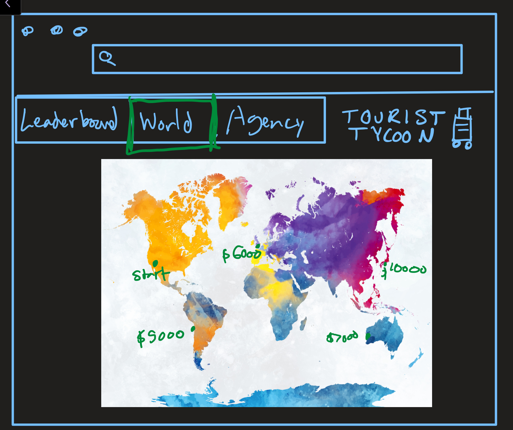
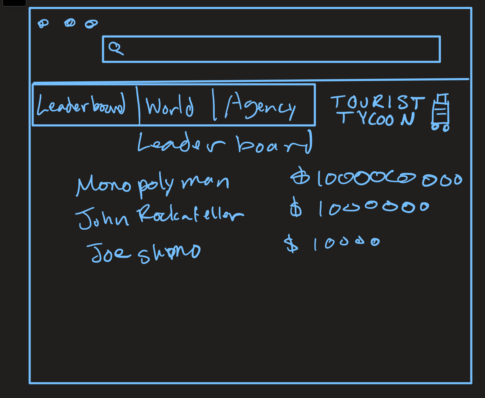

# Startup Specification
A BYU CS260 creation

## Introducing... TOURIST TYCOON 🧳💼🛫 (Elevator Pitch)
How would you like to go to Hong Kong? Or Australia? Or Ecuador? Or Europe? Everyone loves the rush of dopamine at the idea of getting away and vacationing 😎. I mean, come on, wouldn't you rather go skydiving or embark on a cruise or sample fine dining as opposed to taking 18 credits and stressing over your chess project? There's only one thing cooler than that and that is money 🤑. Tourist Tycoon is an online game that gets you _both_! You get to start your own travel agency and work your way up to colonize the world... at least in terms of travel. Invite your friends to play and see who can become the biggest Tourist Tycoon!

## Home Page

Login and register buttons, development news and a brief blurb about the game.

## Register

Pretty self-explanatory.

## Gameplay
The gameplay will consist of three tabs.

### Agency Interface

This is where the user will uprgrade their agencies hotel bookings, travel means, and tours for each individual location.

### Locations

This is where the user can upgrade to expand to different locations.

### Leaderboard

Here the users can scroll and see who has the most money.

## Features
* Login over HTTPS into individual travel agency
* Open the agency and start making profits
* Upgrade attractions, hospitality, and transportation with profits
* Branch out to other contries
* Leaderboard of tycoon net worth
* Push notifications when other players make significant upgrades to their agency
* Tycoon saved and agency closed on logout

## Technology Usage
* **HTML** - page structure
* **CSS** - stylize a user interface that will make for a stylistically beautiful travel agency (for the aesthetic and the vibes)
* **JavaScript** - endpoint calls to login, upgrade tycoon, extend to other countries, view leaderboard
* **Services**
  * Login
  * Get Leaderboard
  * Upgrade agency element
  * Expand to a country
* **WebSocket** - notify other players about upgrades or expansions that a player has made
* **Database** - save login and travel agency
